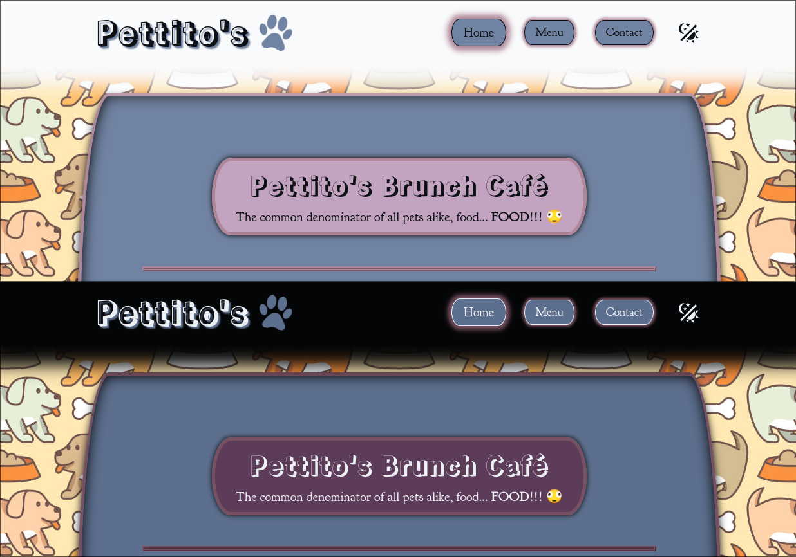

# Sebvu's Restaurant Page

Another fun project, courtesy of [The Odin Project](https://www.theodinproject.com/lessons/node-path-javascript-restaurant-page).

- Created an Element Loader helper using DFS to reduce inserting elements with JS by hundreds of lines
- Dark, and light theme.. of course saved per session as per my projects :)
- A little fun... just check out the website 👀 
